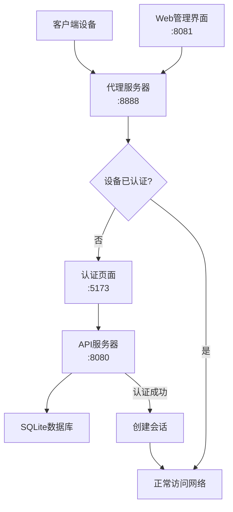

# WiFi 网络认证页面

一个现代化的WiFi二次认证页面，采用React + TypeScript + Vite构建，提供安全、美观、易用的网络接入验证体验。

## ✨ 特性

- 🎨 **现代化UI设计** - 采用扁平化设计风格，支持深色主题
- 📱 **响应式布局** - 完美适配各种设备和屏幕尺寸
- ♿ **无障碍性支持** - 遵循WCAG 2.1 AA标准，支持屏幕阅读器
- 🔒 **安全认证** - 内置表单验证和错误处理机制
- ⚡ **高性能** - 使用Vite构建，支持热模块替换(HMR)
- 🌐 **国际化友好** - 中文界面，支持键盘导航

## 🚀 快速开始

### 系统要求

- Python 3.8+
- Node.js 16+
- npm 或 yarn

### 一键启动（推荐）

```bash
# 安装Python依赖
pip install -r requirements.txt

# 启动完整系统（包括代理、API和前端）
python start_auth_system.py
```

系统启动后将自动运行：
- 🔌 API服务器: http://localhost:8080
- 📡 代理服务器: localhost:8888
- 🌐 Web管理界面: http://localhost:8081
- 💻 前端认证页面: http://localhost:5173

### 手动启动（开发模式）

#### 1. 安装依赖

```bash
# Python依赖
pip install -r requirements.txt

# 前端依赖
npm install
```

#### 2. 启动API服务器

```bash
cd src/pyserver
python auth_api.py
```

#### 3. 启动代理服务器

```bash
mitmdump -s src/pyserver/verifyWifi.py --listen-port 8888 --web-port 8081
```

#### 4. 启动前端开发服务器

```bash
npm run dev
```

### 客户端配置

将需要认证的设备的网络代理设置为：
- **代理服务器**: localhost 或服务器IP
- **端口**: 8888
- **协议**: HTTP

## 🔐 认证信息

默认的认证凭据：
- **用户名**: `addyya`
- **密码**: `sf123123`

## 🔄 工作流程

1. **设备连接**: 用户设备连接到WiFi网络
2. **代理拦截**: 设备访问网络时被代理服务器拦截
3. **认证检查**: 系统检查设备是否已通过认证
4. **跳转认证**: 未认证设备被重定向到认证页面
5. **用户认证**: 用户输入凭据进行身份验证
6. **会话创建**: 认证成功后创建会话令牌
7. **网络访问**: 已认证设备可正常访问网络
8. **会话管理**: 系统管理会话有效期和设备状态

## 📁 项目结构

```
├── src/
│   ├── pages/
│   │   ├── VerifyWifiPage.tsx    # WiFi认证页面组件
│   │   └── VerifyWifiPage.css    # 页面样式文件
│   ├── pyserver/
│   │   ├── verifyWifi.py         # 代理服务器主脚本
│   │   └── auth_api.py           # REST API服务器
│   ├── css/
│   │   └── App.css               # 应用主样式
│   ├── App.tsx                   # 应用根组件
│   ├── main.tsx                  # 应用入口文件
│   └── index.css                 # 全局样式
├── start_auth_system.py          # 系统启动脚本
├── config.json                   # 系统配置文件
├── requirements.txt              # Python依赖列表
├── package.json                  # Node.js依赖配置
└── README.md                     # 项目文档
```

## 🎛️ 系统架构



## 🎯 核心功能

### 用户界面
- 现代化的认证表单设计
- 实时表单验证和错误提示
- 密码显示/隐藏切换功能
- 加载状态和成功状态反馈

### 交互体验
- 支持键盘导航（Tab键切换，ESC键重置）
- 响应式设计，适配移动端
- 平滑的动画过渡效果
- 无障碍性标签和提示

### 技术特性
- TypeScript类型安全
- 函数式组件和Hooks
- CSS变量支持主题切换
- 遵循现代前端开发规范

## 🛠 技术栈

- **前端框架**: React 19 + TypeScript
- **构建工具**: Vite 7
- **样式方案**: CSS3 + CSS变量
- **代码规范**: ESLint + TypeScript ESLint
- **字体**: Inter (Google Fonts)
- **后端**: Python + mitmproxy

## 🔧 配置说明

### 修改认证凭据

在 `src/pages/VerifyWifiPage.tsx` 文件中找到以下代码：

```typescript
const VALID_CREDENTIALS = {
  username: 'addyya',
  password: 'sf123123'
};
```

修改为您需要的用户名和密码。

### 自定义样式主题

在 `src/pages/VerifyWifiPage.css` 文件中的 `:root` 选择器内修改CSS变量：

```css
:root {
  --primary-color: #007bff;    /* 主色调 */
  --success-color: #28a745;    /* 成功色 */
  --error-color: #dc3545;      /* 错误色 */
  /* ... 更多变量 */
}
```

## 📱 响应式断点

- **桌面端**: > 480px
- **平板端**: 360px - 480px  
- **手机端**: < 360px

## ♿ 无障碍性

本项目遵循WCAG 2.1 AA无障碍性标准：

- 支持屏幕阅读器
- 键盘导航友好
- 色彩对比度符合标准
- 提供替代文本和标签
- 支持高对比度模式
- 支持减少动画模式

## 🤝 贡献指南

1. Fork 本仓库
2. 创建特性分支 (`git checkout -b feature/AmazingFeature`)
3. 提交更改 (`git commit -m 'Add some AmazingFeature'`)
4. 推送到分支 (`git push origin feature/AmazingFeature`)
5. 开启 Pull Request

## 📄 许可证

本项目采用 MIT 许可证 - 查看 [LICENSE](LICENSE) 文件了解详情
